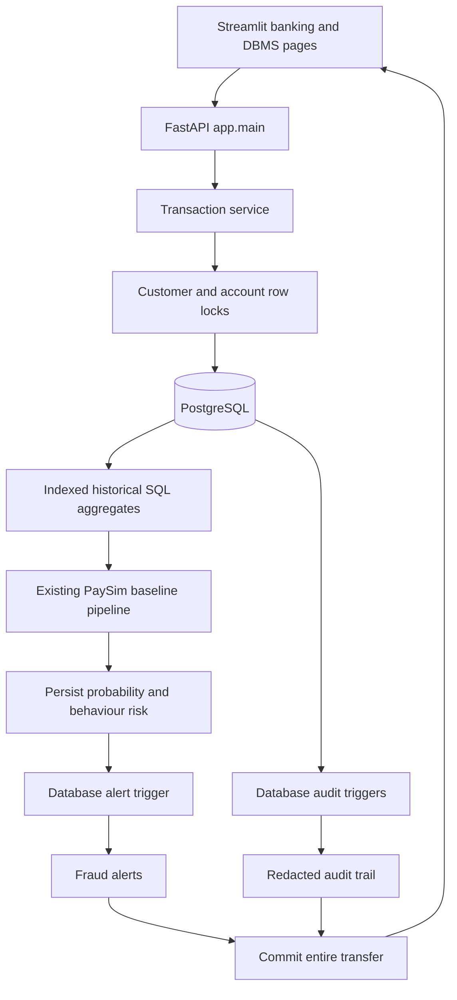

# FraudDetectAI architecture

The database is the system of record. ML is an analysis layer inside the atomic
transaction processing workflow. Existing training and graph exploration code is
preserved.

## Repository audit

Before this implementation:

- `src/fraudgraph/data`: PaySim loading, validation and preprocessing.
- `src/fraudgraph/features`: baseline feature matrices and graph aggregates.
- `src/fraudgraph/models`: sklearn pipelines for logistic regression, Random Forest
  and XGBoost; model saving/loading, comparison, evaluation, threshold tuning and risk scoring.
- `src/fraudgraph/graph`: sender/receiver network creation and analysis.
- `src/fraudgraph/explainability`: feature importance and rule explanations.
- `scripts/`: file-based pipeline entrypoints.
- `app/`: Streamlit overview, fraud detection, graph, model performance and explanations.
- `configs/`: YAML feature lists and model settings.
- `tests/`: 88 existing ML/dashboard tests.
- `data/raw/`: genuine PaySim CSV locally available; trained artifacts were absent.
- No relational database, migrations, banking service or API existed.

Existing batch inference loads joblib pipelines through
`fraudgraph.models.model_registry.load_model`, then uses
`fraudgraph.models.risk_scoring.score_transactions` on saved feature columns.

## Added components

| Component | Responsibility |
|---|---|
| `app/db/models.py` | ORM entities, keys, checks and indexes |
| `app/db/session.py` | Connections; SQLite foreign keys enabled on every connection |
| `alembic/versions/` | Versioned table and database-object migrations |
| `app/db/objects.py` | SQL alert/audit triggers, views and PostgreSQL functions |
| `app/services/transactions.py` | Validation, locks and atomic transfer workflow |
| `app/services/features.py` | Historical aggregates and transparent behaviour rules |
| `app/services/inference.py` | Adapter to the existing baseline preprocessing/model |
| `app/services/analytics.py` | Database reporting, inspection and measured query plans |
| `app/services/demos.py` | Disposable real rollback/concurrency demonstrations |
| `app/api/routes.py`, `app/main.py` | Validated REST endpoints and sanitized errors |
| `app/pages/Banking.py` | Transfer form, history, alerts, customer profiles and registration |
| `app/pages/DBMS_Demonstration.py` | Live schema objects, audit inspector and demonstrations |

## Milestones implemented

1. Audited existing code and established the existing test baseline.
2. Added PostgreSQL and local SQLite connections, schema and migrations.
3. Added atomic transfers and account/customer/device APIs.
4. Integrated the existing baseline model, preserving raw fraud probability.
5. Added behaviour indicators and actual database alert triggers.
6. Added database audit triggers and old/new value inspection.
7. Added indexes and measured EXPLAIN output.
8. Added ordered row locking and simultaneous debit demonstrations.
9. Added SQL views, aggregates and PostgreSQL functions.
10. Extended the existing Streamlit dashboard.
11. Added migration-backed banking integration tests, including optional PostgreSQL tests.
12. Added setup, database design, SQL examples and viva guide.

## ML compatibility and limits

The online service reuses `create_basic_transaction_features` and a fitted baseline
pipeline. It derives origin/destination balances from the actual locked accounts.
Only internal transfers are supported; external payments, deposits and cash-outs
would require separate balance semantics.

The default baseline is Random Forest. A graph-enhanced artifact is rejected if
its required features are missing. Existing graph models remain usable in the batch
pipeline and original dashboard; inventing zero graph features for live accounts
would misrepresent the model input.

PaySim `step` is elapsed hours in the simulation. Online transfers map it to UTC
hour-of-day + 1, an explicit domain adaptation. Device/location metadata is not
passed into the PaySim model. Live banking data has a different distribution and
probabilities are not validated as calibrated real-world banking probabilities.

`train_banking_model.py` creates an integration artifact only if training is needed:
it samples the first N normal PaySim rows and all fraud rows, uses the existing RF
pipeline, and saves a held-out evaluation plus the sample-selection warning.
High scores on this enriched sample do not establish generalization. For research
comparisons use the original full training/evaluation scripts.

Predictions store artifact name and SHA-256 version, model probability, behaviour
score, final heuristic risk, classification, reasons and historical feature snapshots.
The training date and evaluation are in `reports/metrics/banking_model_metadata.json`.

## Risk policy

The raw model probability remains separate. Behaviour rules add risk for velocity,
amount deviation, untrusted devices, changed locations and pre-06:00 UTC transfers.
Weights live in `app/services/features.py`; the behaviour score is capped at 1.
Final risk is `max(model_probability, 0.9 * behaviour_score)`, a conservative alert
heuristic, **not a calibrated probability**. This preserves ML alerts while allowing
a transaction burst to alert even when a dataset-only model sees normal balances.

The database singleton `risk_settings` is the shared classification/alert threshold.
`FRAUD_THRESHOLD` initializes it during migration. Change the persisted setting via
SQL for subsequent transactions; changing the environment alone does not override
an existing database. Existing predictions/alerts are not recomputed retrospectively.

`FRAUD` means the model probability crossed the threshold, `SUSPICIOUS` means the
behaviour-assisted risk crossed it, and `NORMAL` means neither crossed it. Neither
classification proves criminal fraud. Alerts marked `RESOLVED` count as reviewer-confirmed
fraud in this course workflow; `FALSE_POSITIVE` records rejection of the alert.

## Environment and deployment

SQLite is a zero-server fallback with real constraints, migrations, triggers and
views. It uses a database-wide writer lock, not PostgreSQL row locking. PostgreSQL
is the primary academic demonstration engine with JSONB and stored SQL functions.

No authentication is included. Bind locally for the course demo. Mutation demo routes
are only registered for `APP_ENV=development`. Demo rows are disposable; their audit
records deliberately remain. API errors omit SQL statements, connection strings and
personal data. Contact/device fields are excluded from audit payloads.
