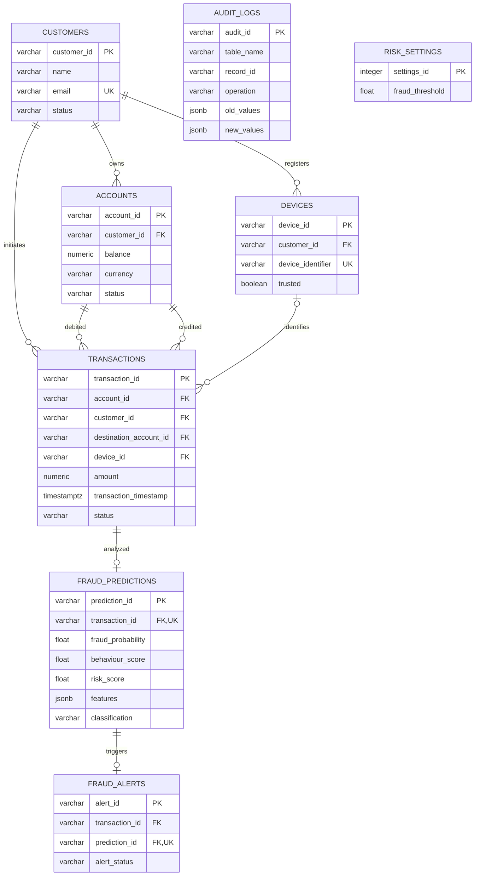

# Database design

A completed service transfer has exactly one prediction; the FK/unique constraint
permits at most one prediction. A temporary transaction without a prediction is
possible inside a database transaction; the service commits only after inference.
Direct SQL users must preserve that service invariant.

## Entities, keys and relationships

- Customers hold names/contact fields once; email is unique.
- Accounts reference customers, use `NUMERIC(18,2)` balances and three-character currencies.
- Devices belong to customers, have a globally unique device identifier and trust flag.
- Transactions reference both debit and credit accounts, and optionally a registered device.
  Balances before/after are immutable financial snapshots in the service workflow.
- Predictions have a unique transaction FK, scores, classification, feature snapshot and artifact metadata.
- Alerts have a unique prediction FK. A composite FK ensures the prediction and
  transaction refer to the same banking operation.
- Audit logs retain redacted history even when demo rows are removed. Their
  polymorphic `table_name/record_id` references deliberately have no FK.
- Risk settings allow only `settings_id=1`, with a threshold strictly between 0 and 1.

## Constraints

Checks reject negative balances, nonpositive amounts, self-transfers, invalid
statuses, invalid scores/classifications and out-of-range geographic coordinates.
A transfer snapshot check enforces source-before minus amount = source-after,
and destination-before plus amount = destination-after.

Composite ownership FKs `(account_id, customer_id)` and `(device_id, customer_id)`
prevent attaching another customer's account/device to a transaction. The service
additionally rejects inactive customers/accounts, insufficient balances and
cross-currency transfers. The API only supports `TRANSFER` and validates two decimal
places, finite numbers, bounded identifiers and payment methods.

## Normalization

1NF: relational fields contain atomic values with no repeating account/device
columns. JSON stores one intentionally structured audit or feature snapshot.

2NF: entity fields depend on their complete single-column primary key.

3NF: customer contact details, account details, device metadata, predictions and
alert workflow are separated rather than duplicated on each financial row.

There are two deliberate constrained redundancies: transaction `customer_id` is
available through the source account but retained for indexed customer history;
alert `transaction_id` is available through its prediction but retained for direct
navigation. Composite FKs enforce both dependencies. Thus those tables are not
strictly pure 3NF; these are explicit query-oriented denormalizations, not an
unqualified claim that every table is in 3NF. Balance/risk snapshots capture facts
at the event time and are not copies of mutable current values.

## Indexes

- `idx_transactions_customer_timestamp`: customer velocity and historical queries.
- `idx_transactions_account_timestamp`: account timeline queries.
- `idx_fraud_predictions_risk`: risk filtering.
- `idx_alert_status`: alert queues.
- Customer FKs on accounts/devices: profile lookup.
- PK and unique indexes: identity, email, device identity, one prediction/alert.

Query plans are available at `/demo/index-performance` or via `docs/dbms_demo.sql`.
PostgreSQL may choose a sequential scan for tiny datasets. No performance gain is
claimed without measured plans; compare representative volumes when benchmarking.

## Database objects

`prediction_alert` fires AFTER INSERT on predictions and compares against the
persisted threshold. It creates an OPEN alert inside the prediction's transaction.
It does not run in Python. Predictions are append-only through the API; the trigger
intentionally applies on insertion, not arbitrary manual score updates.

Audit triggers fire AFTER INSERT/UPDATE/DELETE on customers, accounts, transactions,
predictions and alerts. JSONB is used in PostgreSQL and JSON in SQLite. Only an
allowlist of status/amount/risk/account reference fields is recorded; contact
information, IPs and device identifiers are excluded. PostgreSQL records the
transaction-local application actor when set, otherwise the database user.
SQLite records `local-database` and includes the reviewer in alert JSON.

Views:

- `suspicious_transactions_view`: customers + transactions + predictions + optional alerts.
- `customer_risk_summary`: all customers, including those without history, aggregated
  counts/amount/risk/latest suspicious timestamp.

PostgreSQL SQL functions:

- `calculate_transaction_velocity(customer_key varchar, minutes integer)`.
- `get_customer_transaction_stats(customer_key varchar)`: counts, average amount,
  today's count, suspicious count and maximum risk. "Today" uses the database timezone.

## Migrations

`0dc7c8edf7f5` explicitly creates all tables, checks, indexes and FKs.
`0002` initializes the threshold and installs triggers, views and functions.
Use `alembic upgrade head`; downgrades remove dependent database objects first.
Future schema/object changes must use new migrations; do not edit applied revisions.
SQLite lacks PostgreSQL functions and row-level locking and is clearly labeled in
both the dashboard and demonstrations.
