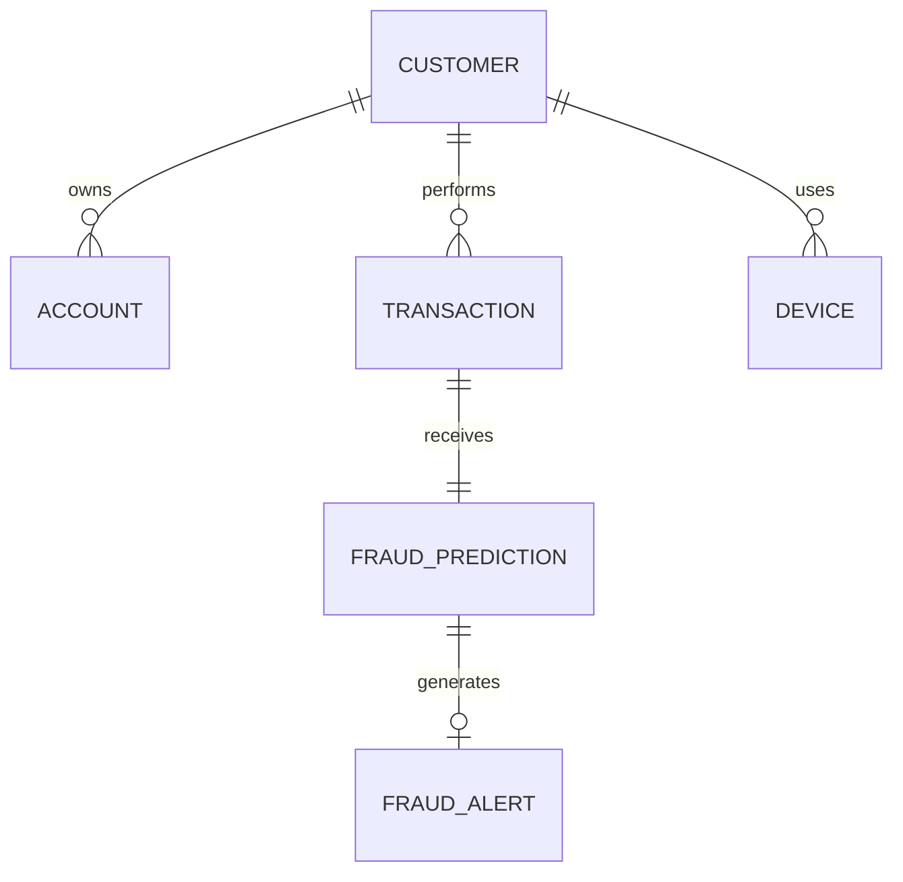

# PROJECT PRD: FraudDetectAI — AI-Based Fraud Detection in Banking Transaction Database

## 1. Role

Act as a senior full-stack engineer, database architect, and ML engineer.

You are working inside an EXISTING project called **FraudDetectAI**.

The project already contains a functional machine-learning pipeline for fraud detection. The ML pipeline must NOT be rewritten unnecessarily.

Your objective is to transform the existing project into a complete **Database Systems course project** titled:

# FraudDetectAI — AI-Based Fraud Detection in Banking Transaction Database

The final system must clearly demonstrate both:

1. A functioning AI/ML fraud detection pipeline.
2. Core DBMS concepts implemented practically inside the application.

The DBMS portion is the PRIMARY academic focus.

---

# 2. Important Existing-System Constraint

Before modifying anything:

1. Inspect the complete repository.
2. Understand:
   - existing ML pipeline
   - preprocessing
   - dataset structure
   - training code
   - inference code
   - APIs
   - frontend/dashboard, if present
   - current folder structure
   - dependencies
3. Do NOT delete or replace working ML functionality.
4. Reuse the existing trained model/pipeline wherever possible.
5. Integrate the database application around the existing inference system.

If something already exists and works, extend it rather than rebuilding it.

---

# 3. Problem Statement

Banks process huge numbers of transactions every day.

Fraudulent activity often appears as unusual customer behaviour such as:

- unusually high transaction amounts
- many transactions in a short period
- transactions from a new device
- sudden geographic location changes
- abnormal transaction timing
- unusual payment methods
- abnormal transaction frequency

Example:

A customer normally makes approximately 2–3 transactions per day.

Suddenly the same customer performs 25 transactions within 10 minutes.

The system should identify this behaviour as suspicious and calculate a fraud-risk score.

The complete workflow should be:

Transaction Database
→ Feature Extraction
→ Existing ML Fraud Detection Model
→ Fraud Probability / Risk Score
→ Classification
→ Store Prediction
→ Generate Alert
→ Maintain Audit Trail

---

# 4. Primary Course Requirements

The final application MUST demonstrate these DBMS concepts clearly:

- relational database design
- primary keys
- foreign keys
- constraints
- normalization
- joins
- transactions
- ACID properties
- concurrency
- triggers
- indexing
- audit logs
- aggregate queries
- views
- stored procedures/functions where useful
- rollback
- transaction isolation
- database-backed analytics

The implementation should make these concepts visible enough that they can be demonstrated during a university project evaluation.

---

# 5. Recommended Technology Stack

Prefer the following unless the existing repository already uses equivalent technologies.

Backend:
- Python
- FastAPI preferred if an API already exists
- existing ML libraries already being used

Database:
- PostgreSQL preferred

Alternative:
- MySQL if the existing project already uses it or PostgreSQL introduces unnecessary complexity

ORM:
- SQLAlchemy

Database migrations:
- Alembic

Frontend:
Reuse existing frontend if present.

If no frontend exists, create a lightweight dashboard using either:

- Streamlit

or

- a simple FastAPI + HTML frontend

Do NOT introduce a heavy frontend framework unless already present.

Everything should be runnable locally.

---

# 6. Proposed Architecture

Implement approximately the following architecture:

```text
                      USER / BANKING DASHBOARD
                                |
                                v
                       Transaction API Layer
                                |
                                v
                      +--------------------+
                      | Transaction Service |
                      +---------+----------+
                                |
                     DATABASE TRANSACTION
                                |
                                v
                      +--------------------+
                      | PostgreSQL Database |
                      +--------------------+
                         |              |
                         |              |
                         v              v
                Feature Queries      Audit System
                         |
                         v
                Feature Engineering
                         |
                         v
                 Existing ML Pipeline
                         |
                         v
                 Fraud Risk Prediction
                         |
                         v
                 Fraud Prediction Table
                         |
                         v
                     DB Trigger
                         |
                risk_score >= threshold
                         |
                         v
                    Fraud Alert
```

---

# 7. Database Schema

Design the relational database approximately as follows.

Adapt fields if required based on the existing dataset.

## TABLE: customers

Fields:

- customer_id — primary key
- name
- email
- phone
- created_at
- status

Suggested status values:

ACTIVE
BLOCKED
UNDER_REVIEW

---

## TABLE: accounts

Fields:

- account_id — primary key
- customer_id — foreign key → customers
- account_type
- balance
- currency
- status
- created_at

Constraints:

balance should not become negative unless explicitly permitted.

---

## TABLE: devices

Fields:

- device_id — primary key
- customer_id — foreign key
- device_type
- device_identifier
- ip_address
- first_seen
- last_seen
- trusted

---

## TABLE: transactions

This is the main table.

Fields should include:

- transaction_id — primary key
- account_id — foreign key
- customer_id — foreign key if useful
- destination_account_id
- amount
- transaction_type
- payment_method
- transaction_timestamp
- location
- latitude if available
- longitude if available
- device_id — foreign key
- status
- created_at

Transaction status values may include:

PENDING
COMPLETED
FAILED
FLAGGED

---

## TABLE: fraud_predictions

Stores output generated by the ML system.

Fields:

- prediction_id — primary key
- transaction_id — unique foreign key
- model_name
- model_version
- fraud_probability
- anomaly_score if available
- risk_score
- classification
- predicted_at

Classification:

NORMAL
SUSPICIOUS
FRAUD

---

## TABLE: fraud_alerts

Fields:

- alert_id — primary key
- transaction_id — foreign key
- prediction_id — foreign key
- risk_score
- reason
- alert_status
- created_at
- reviewed_at
- reviewed_by

Alert status:

OPEN
INVESTIGATING
RESOLVED
FALSE_POSITIVE

---

## TABLE: audit_logs

Fields:

- audit_id — primary key
- table_name
- record_id
- operation
- old_values
- new_values
- changed_at
- changed_by

Use JSON/JSONB for old_values and new_values if PostgreSQL is used.

---

# 8. Dataset Compatibility

The existing ML project may use the PaySim dataset.

Do NOT artificially force fields such as physical location or device ID into ML training if the dataset does not contain them.

Instead:

1. Preserve the existing dataset-driven ML features.
2. Extend the application/database schema with simulated device/location metadata for DBMS demonstration purposes.
3. Clearly separate:
   - real ML features coming from the existing dataset
   - application-level behavioural indicators
   - simulated fields used for demonstration

Do not misrepresent fabricated fields as original dataset attributes.

---

# 9. Feature Engineering

Use the existing feature pipeline wherever possible.

Additionally create database-derived behavioural features.

Examples:

## Transaction-level features

- transaction_amount
- transaction_type
- balance_before
- balance_after

## Historical features

- average_transaction_amount
- max_transaction_amount_last_30_days
- transaction_count_last_10_minutes
- transaction_count_last_hour
- transaction_count_last_24_hours
- average_daily_transaction_count

## Behavioural features

- amount_deviation_from_customer_average
- time_since_previous_transaction
- is_new_device
- location_changed
- unusual_transaction_hour

Do not necessarily retrain the model using every new feature.

Some features can contribute to a secondary rule-based behavioural risk score.

---

# 10. Final Risk Score

If the existing model outputs a fraud probability, preserve it.

For example:

```text
ML fraud probability = 0.84
Behaviour risk score = 0.95
```

A final risk score may optionally be derived using:

```text
final_risk =
0.80 * ml_probability +
0.20 * behavioural_score
```

Only implement this if it makes technical sense with the existing pipeline.

Do not make arbitrary ML modifications purely for appearance.

The original model output should remain separately visible.

---

# 11. Transaction Processing Workflow

Create a complete transaction-processing workflow.

Example:

POST /transactions

Input:

```json
{
  "customer_id": "C102",
  "account_id": "A102",
  "destination_account_id": "A501",
  "amount": 85000,
  "payment_method": "UPI",
  "device_id": "D901",
  "location": "Delhi"
}
```

Workflow:

1. Validate customer.
2. Validate account.
3. Begin DB transaction.
4. Create banking transaction.
5. Update account balances where applicable.
6. Extract database-derived fraud features.
7. Pass feature vector through existing ML model.
8. Calculate fraud probability.
9. Insert fraud prediction.
10. Trigger fraud-alert logic.
11. Write audit records.
12. Commit.

If an essential operation fails:

ROLLBACK.

This should demonstrate ACID properties.

---

# 12. ACID Demonstration

The project must include an easy-to-demonstrate ACID example.

For a transfer:

```text
BEGIN

Debit Account A
Credit Account B
Insert Transaction
Insert Prediction

COMMIT
```

If any step fails:

```text
ROLLBACK
```

Document each ACID property.

## Atomicity

Either the full transfer completes or none of it does.

## Consistency

Constraints ensure invalid balances/accounts cannot be produced.

## Isolation

Concurrent transactions should not corrupt balances.

## Durability

Committed transactions remain stored permanently.

---

# 13. Concurrency Demonstration

Implement a concurrency test.

Example:

Account balance:

₹10,000

Two requests simultaneously attempt:

Transaction 1: debit ₹8,000

Transaction 2: debit ₹7,000

Without transaction locking this could cause an invalid balance.

Use appropriate database locking, for example:

```sql
SELECT ...
FOR UPDATE;
```

or equivalent ORM behaviour.

Ensure only a valid transaction succeeds.

Create a demonstration script/test showing the behaviour.

---

# 14. Database Trigger — Fraud Alert

Create a database trigger that automatically creates an alert when a suspicious fraud prediction is stored.

Conceptually:

```sql
IF NEW.risk_score >= 0.80 THEN
    INSERT INTO fraud_alerts(...)
END IF;
```

Threshold should be configurable where practical.

This trigger is an important DBMS demonstration requirement.

---

# 15. Database Trigger — Audit Logging

Implement triggers for important operations such as:

- transaction update
- customer status update
- fraud alert status change

Store:

- previous value
- new value
- operation
- timestamp

inside audit_logs.

Use PostgreSQL JSONB if appropriate.

---

# 16. Indexing

Create meaningful indexes, not arbitrary indexes.

Required indexes should include something like:

```sql
CREATE INDEX idx_transactions_customer_timestamp
ON transactions(customer_id, transaction_timestamp);
```

Additional possible indexes:

```sql
CREATE INDEX idx_transactions_account_timestamp
ON transactions(account_id, transaction_timestamp);
```

```sql
CREATE INDEX idx_fraud_predictions_risk
ON fraud_predictions(risk_score);
```

```sql
CREATE INDEX idx_alert_status
ON fraud_alerts(alert_status);
```

Demonstrate why the customer + timestamp index matters.

Fraud detection repeatedly calculates queries like:

```sql
SELECT COUNT(*)
FROM transactions
WHERE customer_id = ?
AND transaction_timestamp >= CURRENT_TIMESTAMP - INTERVAL '10 minutes';
```

Include an EXPLAIN / EXPLAIN ANALYZE example showing the query plan.

---

# 17. Views

Create useful SQL views.

## suspicious_transactions_view

Show:

- transaction ID
- customer
- amount
- fraud probability
- risk score
- transaction timestamp
- alert status

## customer_risk_summary

Show:

- customer
- total transactions
- suspicious transactions
- average transaction amount
- maximum risk score
- latest suspicious transaction

---

# 18. Aggregate Queries

Include SQL queries demonstrating:

- COUNT
- AVG
- MAX
- MIN
- SUM
- GROUP BY
- HAVING
- joins
- nested queries

Examples:

Top customers by suspicious transaction count.

Average transaction value per customer.

Transactions exceeding 3× a customer's historical average.

Customers with more than N suspicious transactions.

---

# 19. Joins

Implement meaningful examples of:

INNER JOIN

LEFT JOIN

Potential demonstrations:

customers
JOIN accounts
JOIN transactions
JOIN fraud_predictions
LEFT JOIN fraud_alerts

---

# 20. Stored Procedures / Functions

If PostgreSQL is used, implement at least one useful database function.

Example:

```text
get_customer_transaction_stats(customer_id)
```

Return:

- total transaction count
- average transaction amount
- transaction count today
- suspicious transaction count
- maximum fraud risk score

Another useful option:

```text
calculate_transaction_velocity(customer_id, minutes)
```

---

# 21. Fraud Detection Example

The finished system should support demonstrations like:

Customer normal history:

```text
Average transactions/day: 3
Average transaction amount: ₹4,500
Primary location: Vellore
Trusted device: D102
```

New behaviour:

```text
25 transactions in 10 minutes
Amount: ₹85,000
Location: Delhi
Device: D901
```

System output:

```text
Transaction ID: T10452

Amount:
₹85,000

Transactions in last 10 minutes:
25

Average customer transaction:
₹4,500

New Device:
YES

Location Changed:
YES

ML Fraud Probability:
0.94

Risk Score:
0.92

Status:
SUSPICIOUS
```

The fraud prediction must be persisted inside the database.

---

# 22. Backend API

Create clean REST APIs.

Suggested endpoints:

## Customers

GET /customers

GET /customers/{customer_id}

POST /customers

GET /customers/{customer_id}/transactions

GET /customers/{customer_id}/risk-summary

---

## Transactions

POST /transactions

GET /transactions

GET /transactions/{transaction_id}

GET /transactions/{transaction_id}/prediction

---

## Fraud

GET /fraud/alerts

GET /fraud/alerts/{alert_id}

PATCH /fraud/alerts/{alert_id}

GET /fraud/suspicious-transactions

GET /fraud/statistics

---

## Database Demonstrations

Optional development endpoint group:

GET /demo/index-performance

POST /demo/concurrency

POST /demo/rollback

Do not expose unsafe debugging endpoints in any production configuration.

---

# 23. Dashboard

Create or extend the existing dashboard.

The dashboard should have approximately the following sections.

## Overview

Cards:

- total transactions
- total transaction amount
- suspicious transactions
- confirmed fraud transactions
- open alerts
- average fraud risk

---

## Transactions

Table:

- transaction ID
- customer
- amount
- timestamp
- payment method
- fraud probability
- risk score
- status

Allow filtering by:

- suspicious only
- customer
- amount
- time
- risk score

---

## Fraud Alerts

Display:

- alert ID
- transaction
- customer
- amount
- fraud probability
- risk score
- reason
- alert status

---

## Customer Profile

Show:

- transaction history
- average transaction amount
- transaction frequency
- suspicious transactions
- known devices
- highest observed fraud score

---

## DBMS Demonstration

Add a page/tab showing:

- schema overview
- indexes
- triggers
- database views
- recent audit log entries
- ACID transaction example
- concurrency example

This is particularly useful for university evaluation.

---

# 24. Audit Log Interface

Provide a dashboard/table containing audit records.

Example:

```text
Time              Table         Record    Operation
--------------------------------------------------------
10:35:22           transactions  T10452    INSERT
10:35:22           predictions   P201      INSERT
10:35:22           fraud_alerts  F101      INSERT
10:40:12           fraud_alerts  F101      UPDATE
```

Allow opening a log entry to inspect old and new values where available.

---

# 25. ML Requirements

Use the existing ML model.

Potential algorithms already present or relevant:

- Random Forest
- Isolation Forest
- XGBoost
- One-Class SVM
- Autoencoder

Do NOT implement five algorithms just because they appear in the original problem statement.

If Random Forest is already performing well, it is acceptable to use it as the primary model.

Optionally retain comparison results if they already exist.

The final architecture should prioritize the integration between ML and the database.

---

# 26. Model Metadata

Store metadata such as:

```text
model_name
model_version
training_date
threshold
```

Optionally create:

model_registry

Fields:

- model_id
- model_name
- version
- algorithm
- metrics
- created_at
- active

This is optional but desirable if simple to implement.

---

# 27. Seed Data

Create seed scripts.

Populate at least:

- 20 customers
- 30 accounts
- several trusted devices
- hundreds or thousands of transactions

Include both:

NORMAL patterns

and

SUSPICIOUS scenarios.

Example suspicious patterns:

1. Transaction burst
2. Abnormally high amount
3. New device
4. New location
5. Rapid repeated payments
6. Large transfer at unusual hour

Where possible use the existing PaySim-derived data.

---

# 28. Demo Scenarios

Create automated demo scripts for these scenarios.

## DEMO 1 — Normal Transaction

Normal amount.

Known customer.

Known device.

Normal transaction frequency.

Expected:

NORMAL

---

## DEMO 2 — High Amount

Transaction significantly above customer's historical average.

Expected:

High risk.

---

## DEMO 3 — Transaction Burst

Generate approximately 20–25 transactions within a short time window.

Expected:

High transaction velocity.

Suspicious result.

---

## DEMO 4 — New Device

Use unknown device.

Expected:

Behaviour-risk increase.

---

## DEMO 5 — Rollback

Attempt invalid transfer.

Show:

transaction fails

balance unchanged

no partial database write

---

## DEMO 6 — Concurrency

Execute two simultaneous debit requests.

Show database locking prevents inconsistent balance.

---

## DEMO 7 — Trigger

Insert fraud prediction with:

risk_score >= 0.80

Show fraud alert automatically appears.

---

## DEMO 8 — Audit Log

Update a fraud alert.

Show old value and new value inside audit_logs.

---

# 29. Testing

Add automated tests.

Minimum categories:

## Database

- customer creation
- transaction creation
- foreign key constraints
- invalid records rejected

## Transactions

- successful transfer
- rollback behaviour
- insufficient balance

## Concurrency

- concurrent debit test

## Fraud

- model inference
- fraud prediction stored

## Trigger

- high risk prediction generates alert

## Audit

- updating record creates audit entry

## API

- major endpoint tests

Do not break existing ML tests.

---

# 30. Database Migrations

Use proper database migrations.

If using Alembic:

```text
alembic/
alembic.ini
```

Create migrations for:

- tables
- constraints
- indexes
- triggers
- views/functions if reasonable

Do not require users to manually create tables individually.

---

# 31. Docker

Provide optional Docker setup.

At minimum:

```text
docker-compose.yml
```

Services:

```text
postgres
backend
```

Optional:

frontend

Do not containerize the ML model separately unless there is a strong reason.

---

# 32. Environment Configuration

Use .env.

Example:

```text
DATABASE_URL=
FRAUD_THRESHOLD=0.80
MODEL_PATH=
APP_ENV=
```

Provide:

```text
.env.example
```

Never commit secrets.

---

# 33. Suggested Project Structure

Adapt to the existing repository rather than blindly replacing it.

A possible target is:

```text
frauddetectai/
│
├── app/
│   ├── api/
│   │   ├── customers.py
│   │   ├── transactions.py
│   │   ├── fraud.py
│   │   └── analytics.py
│   │
│   ├── db/
│   │   ├── session.py
│   │   ├── models.py
│   │   ├── repositories/
│   │   └── migrations/
│   │
│   ├── services/
│   │   ├── transaction_service.py
│   │   ├── fraud_service.py
│   │   ├── feature_service.py
│   │   └── audit_service.py
│   │
│   ├── ml/
│   │   └── existing ML pipeline
│   │
│   ├── schemas/
│   │
│   └── main.py
│
├── dashboard/
│
├── scripts/
│   ├── seed_database.py
│   ├── demo_fraud.py
│   ├── demo_concurrency.py
│   └── demo_rollback.py
│
├── tests/
│
├── alembic/
│
├── docs/
│   ├── DATABASE_DESIGN.md
│   ├── DBMS_CONCEPTS.md
│   ├── DEMO_GUIDE.md
│   └── ARCHITECTURE.md
│
├── docker-compose.yml
├── .env.example
├── requirements.txt / pyproject.toml
└── README.md
```

Again:

DO NOT restructure working code unnecessarily.

---

# 34. Documentation Requirements

Generate strong documentation because this is an academic project.

Create:

## README.md

Include:

- project overview
- problem statement
- architecture
- technology stack
- setup
- database setup
- ML integration
- running the application
- screenshots placeholder
- testing
- demo workflow

---

## docs/DATABASE_DESIGN.md

Include:

- database entities
- relationships
- PKs
- FKs
- normalization
- constraints
- indexes
- views
- stored procedures
- triggers

Also include a Mermaid ER diagram.

Example:



Expand correctly based on actual implementation.

---

## docs/DBMS_CONCEPTS.md

Explain how this project demonstrates:

- transactions
- ACID
- concurrency
- locking
- indexing
- triggers
- normalization
- joins
- aggregate queries
- audit logging
- constraints
- views
- stored functions

Give actual implementation examples from the repository.

---

## docs/DEMO_GUIDE.md

Write a 5–10 minute university demonstration sequence.

Suggested order:

1. Show schema.
2. Insert normal transaction.
3. Show prediction.
4. Generate suspicious transaction.
5. Show risk score.
6. Show trigger-created alert.
7. Show audit log.
8. Show index.
9. Show concurrency protection.
10. Show rollback.
11. Show dashboard statistics.

Include exact commands wherever possible.

---

# 35. Required SQL Demonstration File

Create:

```text
docs/dbms_demo.sql
```

Include commented examples showing:

- SELECT
- INSERT
- UPDATE
- DELETE if safe
- INNER JOIN
- LEFT JOIN
- GROUP BY
- HAVING
- aggregate queries
- nested query
- view query
- stored function call
- transaction
- rollback
- indexes
- EXPLAIN ANALYZE

This file should be usable during the practical evaluation.

---

# 36. Academic Emphasis

The project must NOT look like:

"an ML fraud detector with a database added afterward."

It should look like:

"a transaction processing database system with integrated AI fraud detection."

The core academic story should be:

```text
The database stores and processes financial transactions.

DBMS mechanisms guarantee transaction integrity, concurrency safety,
efficient querying, auditability and persistence.

Machine learning works as an intelligent fraud-analysis layer on top of
the transactional database.
```

---

# 37. Normalization

Ensure database structure is at least reasonably normalized to 3NF.

For documentation, explain:

## 1NF

Atomic values.

No repeating groups.

## 2NF

Non-key attributes depend on the entire primary key.

## 3NF

Avoid unnecessary transitive dependencies.

For example:

customer details should not be duplicated inside every transaction.

Device information should reside in devices.

Fraud analysis belongs in fraud_predictions.

Alerts belong in fraud_alerts.

---

# 38. Security

Implement basic security practices.

- parameterized SQL / ORM
- no raw untrusted SQL
- environment variables
- input validation
- prevent negative amounts
- ensure accounts exist
- prevent inconsistent transfers
- hide sensitive fields from logs

Authentication is optional unless already present.

Do not overbuild auth if it distracts from DBMS requirements.

---

# 39. Performance

Make feature queries efficient.

Avoid loading a customer's entire transaction history into Python whenever SQL aggregation can do the work.

Prefer SQL such as:

```sql
COUNT()
AVG()
MAX()
MIN()
SUM()
```

combined with properly indexed filters.

This demonstrates actual database-system design.

---

# 40. Error Handling

Implement clear errors for:

- customer not found
- account not found
- invalid amount
- insufficient balance
- model inference failure
- database failure
- transaction rollback

No partial banking operation should remain committed after a failure.

---

# 41. Implementation Strategy

Proceed in milestones.

## Milestone 1 — Repository Audit

Inspect the existing project.

Produce:

- current architecture
- ML pipeline location
- inference entrypoint
- technologies used
- database status
- files that should be reused

Do NOT immediately rewrite things.

---

## Milestone 2 — Database Foundation

Implement:

- PostgreSQL/MySQL connection
- ORM models
- migrations
- schema
- constraints
- seed data

Verify database independently.

---

## Milestone 3 — Transaction Service

Implement:

- customer/account management
- banking transactions
- balance updates
- rollback behaviour
- ACID-safe transaction boundaries

---

## Milestone 4 — ML Integration

Connect the existing model to transactions.

Flow:

DB transaction
→ feature extraction
→ model
→ prediction

Store prediction.

---

## Milestone 5 — Fraud Alert System

Implement:

- fraud prediction persistence
- trigger
- fraud alerts
- behavioural indicators

---

## Milestone 6 — Audit Logging

Implement audit triggers and audit interface.

---

## Milestone 7 — Indexing and Query Optimization

Create meaningful indexes.

Benchmark/explain important queries.

---

## Milestone 8 — Concurrency

Add row locking and concurrency demonstration.

---

## Milestone 9 — Analytics

Implement:

- views
- aggregate queries
- risk summary
- customer summary

---

## Milestone 10 — Dashboard

Integrate all required views into a clean demo UI.

---

## Milestone 11 — Testing

Run all tests and repair failures.

---

## Milestone 12 — Documentation

Produce:

README.md

DATABASE_DESIGN.md

DBMS_CONCEPTS.md

DEMO_GUIDE.md

dbms_demo.sql

---

# 42. Codex Working Rules

Follow these rules throughout implementation.

1. Inspect before modifying.

2. Preserve the existing functional ML pipeline.

3. Do not delete working features without a clear reason.

4. Prefer minimal, maintainable changes.

5. Use proper service separation.

6. Avoid giant single files.

7. Never hard-code secrets.

8. Use migrations rather than requiring manual schema creation.

9. Add type hints where appropriate.

10. Add tests for new functionality.

11. Keep code beginner-readable because this is also a university project.

12. Do not introduce enterprise-level complexity that provides no academic or functional benefit.

13. All implemented DBMS concepts must serve an understandable purpose.

14. Whenever changing an existing file, inspect it first.

15. Do not leave placeholder pseudo-code in functionality required for the demo.

---

# 43. Very Important — Do Not Fake Functionality

Do NOT:

- hard-code fake fraud results
- display risk scores that were not produced by the model/risk logic
- claim the dataset contains location/device data if it does not
- simulate a database operation only in the UI
- claim a trigger exists when the logic actually runs only in Python
- claim concurrency protection without implementing locking
- claim rollback without testing actual DB rollback
- claim indexing improvements without actual indexes

The final system should be technically defensible during a viva.

---

# 44. Final Validation Checklist

Before considering the project complete, verify all of the following.

## AI

- Existing fraud model works
- Transaction can be passed to inference
- Fraud probability is returned
- Prediction is persisted

## Database

- customers table
- accounts table
- devices table
- transactions table
- fraud_predictions table
- fraud_alerts table
- audit_logs table

## DBMS

- primary keys
- foreign keys
- constraints
- normalization
- transactions
- ACID
- rollback
- concurrency
- locking
- triggers
- indexes
- audit logs
- joins
- aggregate queries
- views
- stored database function

## Application

- create transaction
- predict fraud
- store result
- automatically create alert
- view alerts
- view transaction history
- view customer statistics
- view audit history

## Demonstration

- normal transaction
- suspicious transaction
- high-frequency attack
- trigger
- audit log
- rollback
- concurrency
- index/query plan

## Documentation

- README
- architecture
- ER diagram
- database documentation
- DBMS concepts explanation
- SQL demo file
- demo guide

---

# 45. Expected Final Project Story

The final project should demonstrate this complete pipeline:

```text
Customer initiates transaction
            ↓
Transaction validated
            ↓
Database transaction starts
            ↓
Balances safely updated
            ↓
Transaction stored
            ↓
Historical behaviour queried using indexed SQL
            ↓
Features extracted
            ↓
Existing FraudDetectAI model runs
            ↓
Fraud probability generated
            ↓
Prediction stored
            ↓
Database trigger checks risk
            ↓
Suspicious transaction automatically creates alert
            ↓
Audit log records critical changes
            ↓
Transaction commits
            ↓
Dashboard displays result
```

Example final output:

```text
Transaction ID: T10452

Customer: C102

Amount: ₹85,000

Transactions in last 10 minutes:
25

Customer Average Amount:
₹4,500

New Device:
Yes

Location Changed:
Yes

ML Fraud Probability:
0.94

Behaviour Score:
0.85

Final Risk Score:
0.92

Classification:
SUSPICIOUS

Fraud Alert:
CREATED
```

---

# 46. First Task

Do NOT begin coding blindly.

First inspect the repository and respond with:

1. current project structure
2. where the existing ML pipeline lives
3. how fraud inference currently works
4. what database functionality already exists
5. what parts of this PRD are already implemented
6. what parts are missing
7. files that should be added
8. files that should be modified
9. proposed final architecture
10. milestone-by-milestone implementation plan

After this repository audit, begin implementation from Milestone 2.

Whenever possible, run the application/tests after each milestone and fix regressions before continuing.

The final goal is a functioning, locally runnable, viva-ready Database Systems project rather than only a prototype.
